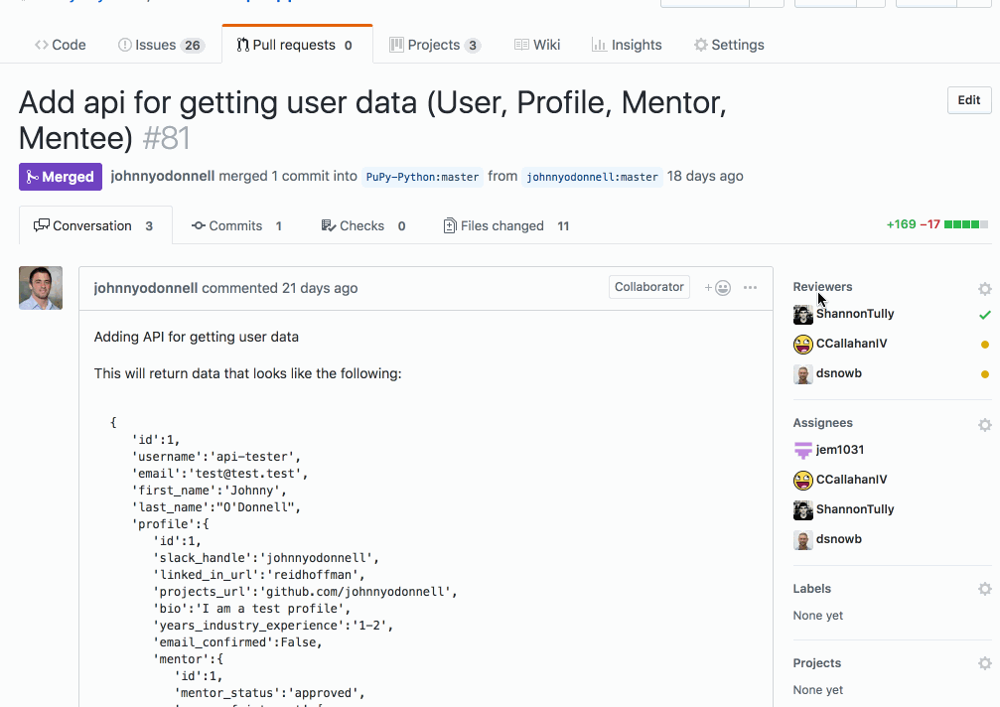
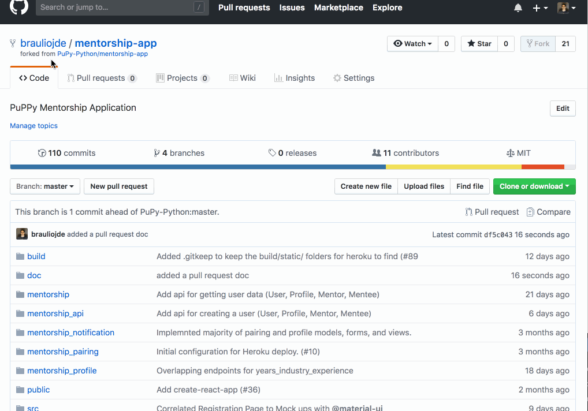
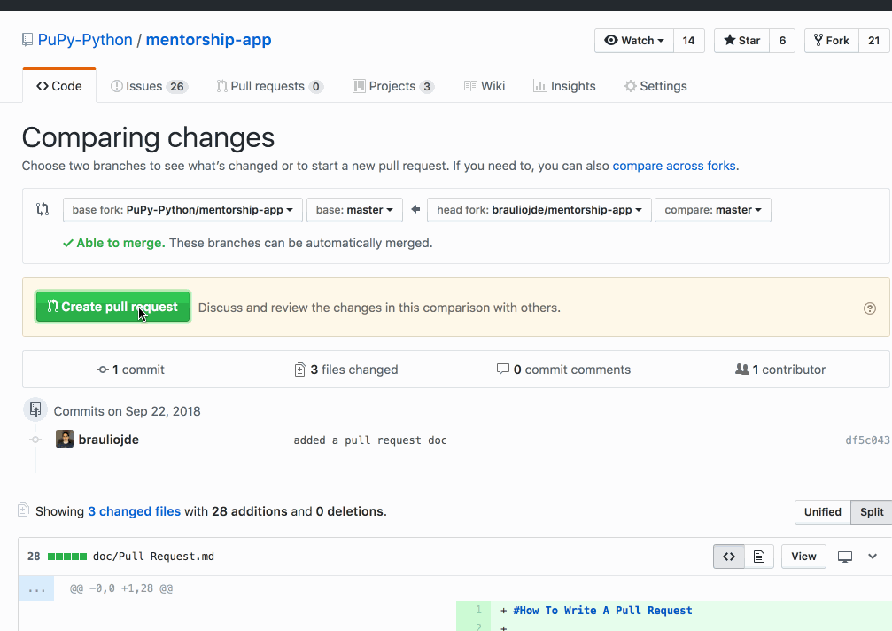
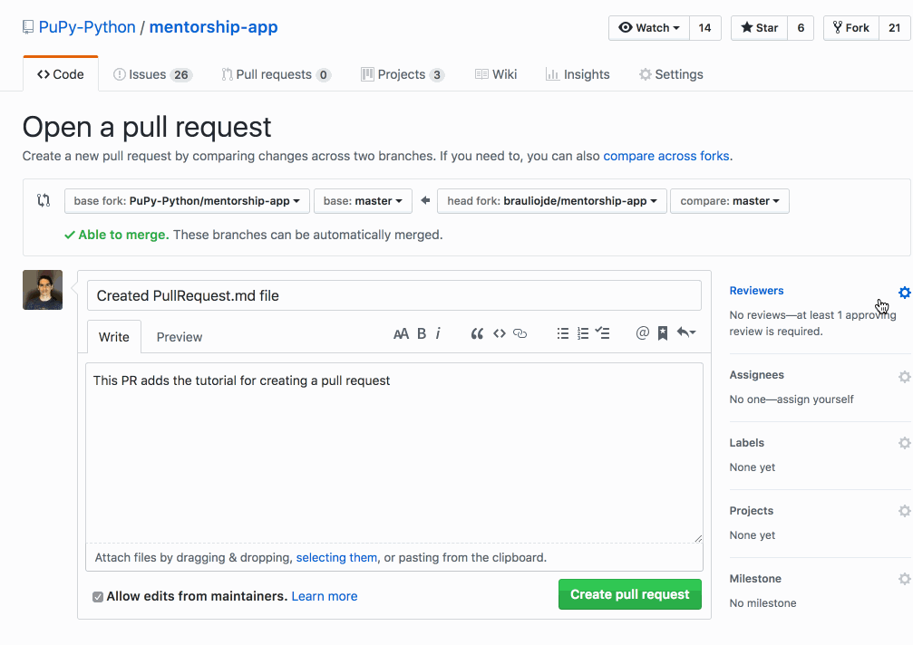

#How To Write A Pull Request

PuPPy-Python Mentorship App expectations for creating a Pull Request

###Prerequisites
In order to create a pull request, the prerequisites from the Contribute document must be met. These include the following

1. Rebasing the feature branch from upstream/master
2. Having only 1 commit per PR

###Pull Request Hygiene
In order to succesfully merge a PR you must

1. Clearly and concisely describe your PR
2. Have a small PR, this will help your reviewers
3. Have at least one person assigned to review it
	

###Performing a Pull Request
If your commits have been squashed into 1 commit, and you have pushed your feature onto your fork/remote repository then you are ready for a Pull Request.

##### 1. Go to your forked github repository
##### 2. Make sure that your branch is ONLY 1 commit ahead of the master(In our case it is PuPy-Python:master)
  * If your branch is behind the master, then you need to rebase
  * If it is ahead by more than 1 commit, then you need to squash your commits(see Contribute.md)

##### 3. Click create pull request and enter a name and description for the PR

##### 4. Assign a Reviewer

